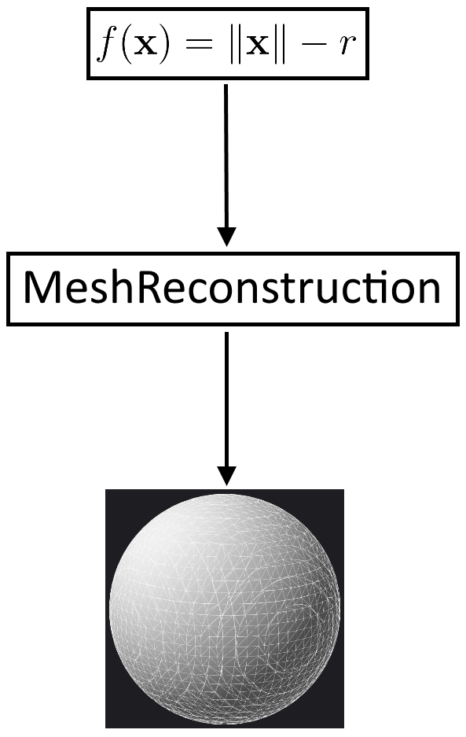

# MeshReconstruction

This is a small library that can reconstruct a triangle mesh from a <a href="http://www.iquilezles.org/www/articles/distfunctions/distfunctions.htm">signed distance function</a> using the <a href="https://en.wikipedia.org/wiki/Marching_cubes">Marching Cubes algorithm</a> and export it to a file in the <a href="https://de.wikipedia.org/wiki/Wavefront_OBJ">obj format</a>.

The library is self-contained and has no dependencies. The library is fast due to precomputed lookup tables and a narrow-band approach which excludes a lot of marching cubes that are far away from the surface.

The library requires C++14 and has been tested under Visual Studio 2017 and Windows 10 but should port to other systems without major problems.

The library can be used under the terms of the MIT License.

  

